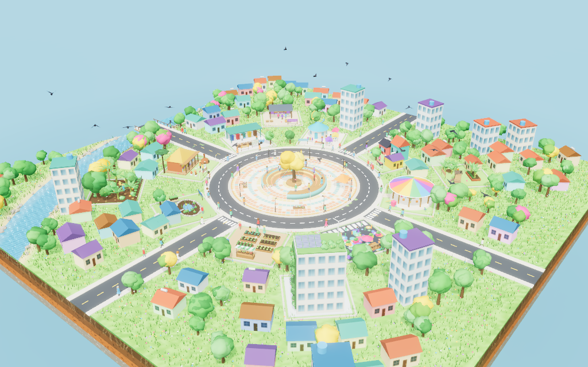
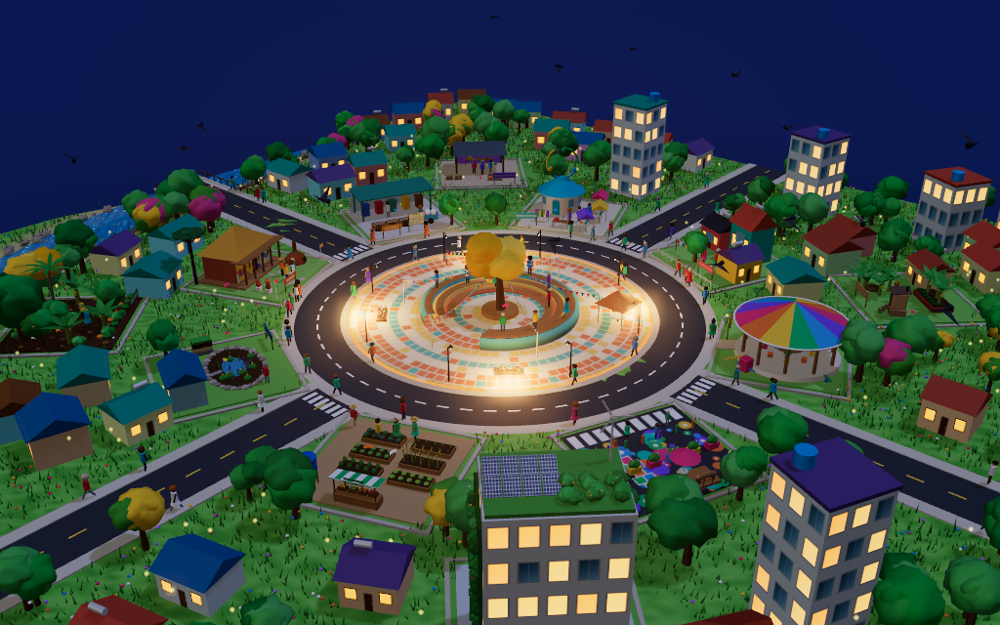

# 🌱 Território Vivo — Projetos Socioambientais Participativos

Jogo educativo em 3D, pronto para o **GitHub Pages**, sobre **projetos socioambientais participativos**. A pessoa jogadora transforma um bairro, missão por missão, junto com a comunidade, e não apenas para ela. O ponto de partida é a pauta formativa *Projeto Praça Viva*: **ouvir a comunidade significa, necessariamente, fazê-la participar?**




---

## ✨ O que o jogo tem

| Recurso | Descrição |
|---|---|
| 🗺️ **Maquete 3D viva** | Bairro em miniatura com rio, ponte, praça, ruas e 13 construções sustentáveis. Tem sombras suaves, iluminação física, brilho noturno (*bloom*), efeito de miniatura (*tilt-shift*), ciclo de dia, entardecer e noite, chuva, nuvens, pássaros, borboletas, vaga-lumes e moradores caminhando. |
| 🎯 **13 missões** | Uma missão inicial na praça, 11 construções sustentáveis e uma missão final no Conselho do Território. |
| 🪜 **5 etapas por missão** | Diagnóstico, priorização, planejamento, implementação e acompanhamento. |
| ❓ **73 perguntas** | Múltipla escolha diversificada: situação-problema, conceito, legislação, interdisciplinar, decisão pedagógica, indicadores e **dilemas participativos**. As alternativas, corretas e distratoras, têm tamanhos semelhantes (variação máxima de 15%) e são **embaralhadas a cada vez**. |
| 🗳️ **Dilemas participativos** | Cada alternativa corresponde a um degrau da escada da participação: **informação, consulta, cogestão ou autonomia**. O **participômetro** mostra o nível das suas decisões. |
| 🌳 **Dossel da praça** | A missão da praça cria um anel de 20 árvores nativas (ipês, oitis, sibipirunas e pitangueiras) com copas que se encostam e sombreiam a calçada e os bancos. O indicador **Sombra na praça** mostra a porcentagem do piso coberta pelas copas, e a Engenheira Lia explica a relação com as ilhas de calor quando o dossel se fecha. |
| 🌿 **Ações sustentáveis** | Com as sementes conquistadas, você espalha pelo bairro e pelos canteiros circulares da praça ipês, oitis, sibipirunas, pitangueiras, canteiros de polinizadores, abelhas sem ferrão, bancos de pallet, lixeiras seletivas, composteiras, cisternas, postes solares e bicicletários. |
| 📊 **Indicadores do território** | Biodiversidade, água, resíduos, comunidade e economia local. Eles mudam a maquete: a grama fica mais verde, o rio fica limpo, o lixo some e mais pessoas aparecem nas ruas. |
| 🎙️ **Narração oral completa** | Missões, etapas, perguntas, alternativas, painéis, itens e orientações são narrados por **quatro apresentadores**, cada um com papel, gênero e voz próprios. |
| ⚡ **Desafio Relâmpago** | Dez perguntas sorteadas de todo o jogo. |
| 🏅 **Certificado** | Gerado ao concluir a missão final, pronto para imprimir ou salvar em PDF. |
| ⚙️ **Gráficos adaptáveis** | O jogo estima a capacidade da placa de vídeo e mede os quadros por segundo enquanto você joga. Se o computador não acompanhar, os gráficos descem um degrau por vez (Ultra → Alta → Média → Leve → Mínima) e voltam a melhorar quando houver folga. Em **⚙️ Vozes e gráficos** é possível fixar um nível. |
| 📱 **Responsivo e acessível** | Funciona no computador, no tablet e no celular. Tem legendas sincronizadas, atalhos de teclado (A–D ou 1–4 para responder, Enter para continuar, Esc para fechar) e respeita a opção de reduzir animações. |

### Os apresentadores

| | Personagem | Papel | Voz |
|---|---|---|---|
| 🧡 | **Dona Jurema** | Líder comunitária e guardiã da memória do bairro | Feminina, madura e calorosa |
| 💙 | **Professor Caio** | Mediador pedagógico e educador ambiental | Masculina, firme e didática |
| 💜 | **Engenheira Lia** | Engenheira ambiental e arquiteta social | Feminina, jovem e técnica |
| 💚 | **Téo** | Estudante do Técnico em Meio Ambiente | Masculina, jovem e animada |

### As missões

| # | Missão | Construção ou ação sustentável |
|---|---|---|
| 0 | Escuta que vira decisão | Roda de Escuta da Praça Viva |
| 1 | Floresta que alimenta | Agrofloresta comunitária |
| 2 | Resíduo tem lugar | Gestão participativa de resíduos (ecoponto) |
| 3 | Memória que vive | Ecomuseu e turismo de base comunitária |
| 4 | Rua de brincar | Urbanismo tático |
| 5 | Chuva que vira vida | Jardim de chuva comunitário |
| 6 | Comida que une | Hortas comunitárias e cooperativas |
| 7 | Nada se perde | Economia circular participativa |
| 8 | Saneamento é dignidade | Ecofossas e saneamento ecológico |
| 9 | Casa boa é direito | Arquitetura social e reforma de moradias |
| 10 | Mãos que transformam | Oficinas de reaproveitamento |
| 11 | Prédio que respira | Prédio com certificação verde |
| 12 | Conselho do Território *(final)* | Casa do Conselho e Mapa Interdisciplinar de Participação |

---

## 🚀 Como publicar no GitHub (5 minutos)

1. Crie um repositório novo no GitHub, por exemplo `territorio-vivo`.
2. Envie todos os arquivos desta pasta para a branch `main`, inclusive a pasta oculta `.github`:
   ```bash
   git init
   git add .
   git commit -m "Território Vivo"
   git branch -M main
   git remote add origin https://github.com/SEU-USUARIO/territorio-vivo.git
   git push -u origin main
   ```
   Se preferir, use **Add file → Upload files** no site do GitHub e arraste o conteúdo da pasta.
3. No repositório, abra **Settings → Pages** e, em **Build and deployment → Source**, escolha **GitHub Actions**.
4. Abra a aba **Actions**. O fluxo **Publicar o jogo no GitHub Pages** roda sozinho. Se ele ainda não tiver rodado, clique em **Run workflow**.
5. Em poucos minutos o jogo estará em `https://SEU-USUARIO.github.io/territorio-vivo/`.

### 🎙️ Vozes humanas e naturais

A cada publicação, o fluxo do GitHub Actions executa `ferramentas/gerar_vozes.py`, que grava cerca de **600 falas em MP3 com vozes neurais**, uma voz diferente para cada apresentador:

| Personagem | Voz neural |
|---|---|
| Dona Jurema | `pt-BR-FranciscaNeural`, mais lenta e grave |
| Professor Caio | `pt-BR-AntonioNeural` |
| Engenheira Lia | `pt-BR-ThalitaMultilingualNeural` |
| Téo | `pt-BR-MacerioMultilingualNeural`, com `pt-BR-AntonioNeural` mais agudo como reserva |

As vozes da Lia e do Téo são multilíngues. Para que elas nunca troquem de idioma no meio da frase, o gerador envia o texto marcado como português do Brasil (`xml:lang="pt-BR"` e o elemento `<lang>`). Se o serviço não aceitar essa marcação, ele usa automaticamente a próxima voz da lista, que fala só português. Siglas, números e palavras estrangeiras passam pelo ajuste de pronúncia definido em `pronuncia`, no arquivo `data/conteudo.json`.

As vozes ficam guardadas em cache e só são refeitas quando o texto muda. Se a geração falhar, o jogo é publicado mesmo assim e usa as **vozes do próprio navegador**. Nesse caso, ele escolhe automaticamente uma voz feminina ou masculina em português para cada apresentador, dando preferência às vozes naturais do Microsoft Edge e do Google Chrome. Em **⚙️ Vozes e gráficos** é possível trocar a voz de cada personagem, a velocidade e o volume.

> As vozes neurais são geradas com a biblioteca de código aberto [`edge-tts`](https://github.com/rany2/edge-tts), que usa o serviço de leitura em voz alta do Microsoft Edge. Para não usá-lo, apague o passo **Gerar as vozes neurais** do arquivo `.github/workflows/pages.yml`.

Para gerar as vozes no seu computador e enviá-las junto com o repositório:

```bash
pip install edge-tts
python ferramentas/gerar_vozes.py
```

---

## 💻 Rodar no computador

O jogo usa módulos JavaScript e carrega arquivos JSON. Por isso, ele precisa de um servidor simples e não abre com duplo clique no `index.html`.

```bash
python -m http.server 8000
# depois acesse http://localhost:8000
```

Não é preciso instalar mais nada: a biblioteca **three.js r169** já está incluída em `lib/three`.

---

## ✏️ Como adaptar o conteúdo

Todo o conteúdo está em **`data/conteudo.json`**:

- `personagens`: nome, papel, gênero, cor e vozes de cada apresentador;
- `missoes`: história de abertura (`intro`), perguntas, ficha técnica, encerramento e efeito nos indicadores;
- `perguntas`: `etapa`, `tipo`, narrador (`n`), enunciado (`q`), alternativas (`alt`, com `"c": true` na correta ou `"nivel"` nos dilemas) e explicação (`e`);
- `extras`: perguntas adicionais do Desafio Relâmpago;
- `itens`: ações sustentáveis, custo em sementes e efeito nos indicadores;
- `sistema`: narrações dos painéis, reações e falas finais.

Depois de editar, publique novamente. As vozes das falas novas ou alteradas são geradas automaticamente.

---

## 🗂️ Estrutura

```
├── index.html                 Página do jogo
├── css/estilo.css             Visual (cores, painéis, animações, versão para celular e para impressão)
├── js/
│   ├── jogo.js                Regras: missões, perguntas, pontuação, ações, progresso salvo
│   ├── maquete.js             Cena 3D: terreno, rio, ruas, luz, clima, vida, pós-processamento
│   ├── modelos.js             Modelos 3D procedurais das construções, pessoas, árvores e itens
│   ├── texturas.js            Texturas desenhadas por código (fachadas, pisos, pinturas, placas)
│   ├── voz.js                 Motor de narração (MP3 neurais e vozes do navegador)
│   ├── sons.js                Efeitos sonoros e ambiente sintetizados
│   └── avatares.js            Retratos ilustrados dos apresentadores
├── data/conteudo.json         Missões, perguntas, falas e itens
├── audio/                     Narrações MP3 (geradas automaticamente)
├── ferramentas/gerar_vozes.py Gerador das vozes neurais
├── lib/three/                 three.js r169 (MIT)
└── .github/workflows/pages.yml Publicação automática no GitHub Pages
```

O progresso é salvo no próprio navegador. Para recomeçar, use **⚙️ → Reiniciar progresso**.

---

## 📚 Referências usadas no conteúdo

- Política Nacional de Resíduos Sólidos, Lei 12.305/2010.
- Lei de Assistência Técnica para Habitação de Interesse Social, Lei 11.888/2008.
- Programa Nacional de Alimentação Escolar, Lei 11.947/2009, com no mínimo 30% de compras da agricultura familiar.
- Marco Legal do Saneamento, Lei 14.026/2020, com a meta de 90% de coleta e tratamento de esgoto até 2033.
- Selo Casa Azul (Caixa), LEED, AQUA-HQE, EDGE e Procel Edificações.
- Banco Palmas (Conjunto Palmeiras, Fortaleza, 1998).

## 📄 Licença

Código sob licença MIT. A biblioteca three.js também é distribuída sob licença MIT.
